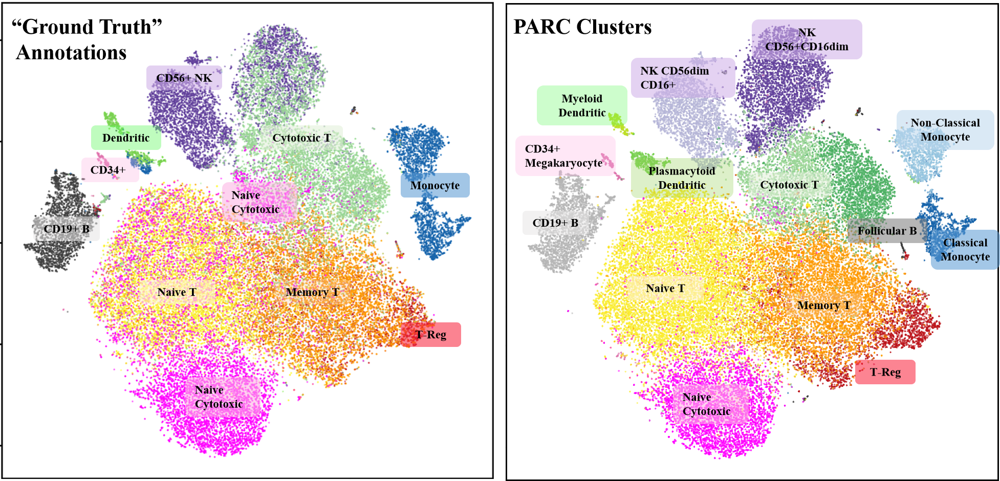
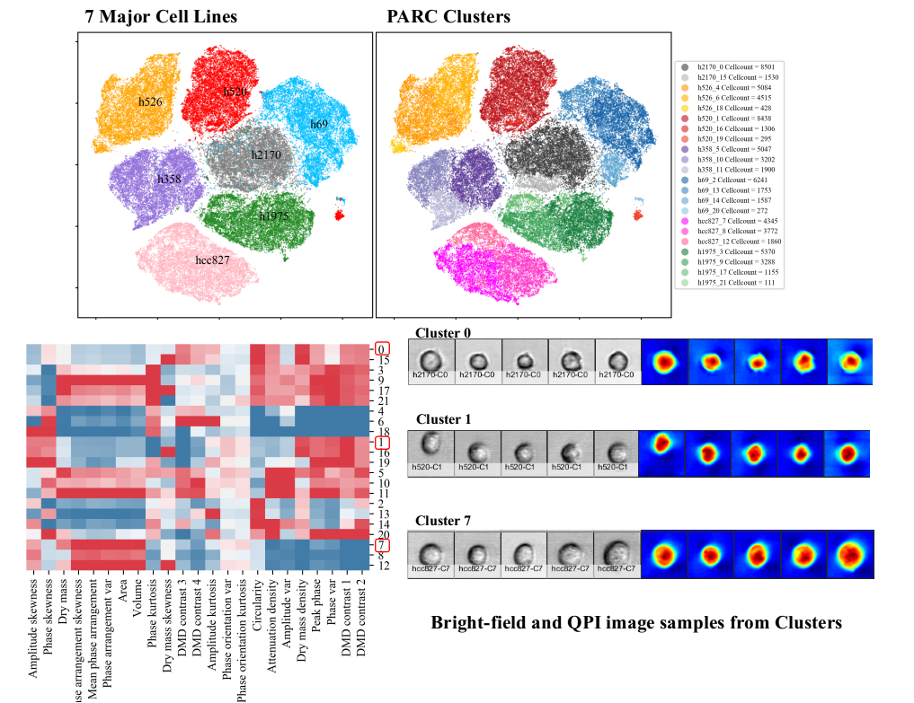

# PARC
PARC, “phenotyping by accelerated refined community-partitioning” - is a fast, automated, combinatorial  graph-based clustering approach that integrates hierarchical graph construction (HNSW) and data-driven graph-pruning with the new Leiden community-detection algorithm.

## Getting Started
### install using pip
```
conda create --name ParcEnv pip // (optional)
pip install parc // tested on linux
```
### install by cloning repository and running setup.py 
```
git clone https://github.com/ShobiStassen/PARC.git 
python3 setup.py install // cd into the directory of the cloned PARC folder containing setup.py and issue this command
```

### install dependencies separately if needed
pip install leidenalg, igraph and hnswlib
  
## Example Usage 1. (small test sets) - IRIS and Digits dataset from sklearn

```
from parc import PARC
import matplotlib.pyplot as plt
from sklearn import datasets

// load sample IRIS data
//data (n_obs x k_dim, 150x4)
iris = datasets.load_iris()
X = iris.data
y=iris.target

plt.scatter(X[:,0],X[:,1], c = y) // colored by 'ground truth'
plt.show()

Parc1 = parc.PARC(X,y) // instantiate PARC
Parc1.run_PARC() // run the clustering
parc_labels = Parc1.labels

# View scatterplot colored by PARC labels

plt.scatter(X[:, 0], X[:, 1], c=parc_labels)
plt.show()

// load sample digits data
digits = datasets.load_digits()
X = digits.data // (n_obs x k_dim, 1797x64) 
y = digits.target
Parc2 = parc.PARC(X,y, jac_std_global='median') // 'median' is default pruning level
Parc2.run_PARC()
parc_labels = Parc2.labels

```
## Example Usage 2. (mid-scale scRNA-seq): 10X PBMC (Zheng et al., 2017)
[pre-processed datafile](https://drive.google.com/file/d/1H4gOZ09haP_VPCwsYxZt4vf3hJ1GZj3b/view?usp=sharing)

[annotations](Datasets/annotations_zhang.txt)

```
import PARC
import csv

## load data (50 PCs of filtered gene matrix pre-processed as per Zheng et al. 2017)

X = csv.reader(open("'./pca50_pbmc68k.txt", 'rt'),delimiter = ",")
X = np.array(list(X)) // (n_obs x k_dim, 68579 x 50)
X = X.astype("float")
// OR with pandas as: X = pd.read_csv("'./pca50_pbmc68k.txt").values.astype("float")

y = [] // annotations
with open('/annotations_zhang.txt', 'rt') as f: 
    for line in f: y.append(line.strip().replace('\"', ''))
// OR with pandas as: y =  list(pd.read_csv('./data/zheng17_annotations.txt', header=None)[0])   


parc1 = parc.PARC(X,y) // instantiate PARC
parc1.run_PARC() // run the clustering
parc_labels = parc1.labels 
```
 tsne plot of annotations and PARC clustering

## Example Usage 3. 10X PBMC (Zheng et al., 2017) integrating Scanpy pipeline

[raw datafile](https://github.com/10XGenomics/single-cell-3prime-paper/tree/master/pbmc68k_analysis)

```
pip install scanpy
```

```
import scanpy.api as sc
import pandas as pd
//load data
path = './data/zheng17_filtered_matrices_mex/hg19/'
adata = sc.read(path + 'matrix.mtx', cache=True).T  # transpose the data
adata.var_names = pd.read_csv(path + 'genes.tsv', header=None, sep='\t')[1]
adata.obs_names = pd.read_csv(path + 'barcodes.tsv', header=None)[0]

// annotations as per correlation with pure samples
annotations = list(pd.read_csv('./data/zheng17_annotations.txt', header=None)[0])
adata.obs['annotations'] = pd.Categorical(annotations)

//pre-process as per Zheng et al., and take first 50 PCs for analysis
sc.pp.recipe_zheng17(adata)
sc.tl.pca(adata, n_comps=50)
parc1 = parc.PARC(adata2.obsm['X_pca'], annotations)
parc_labels = parc1.labels
adata2.obs["PARC"] = pd.Categorical(parc_labels)

//visualize
sc.pl.umap(adata, color='annotations')
sc.pl.umap(adata, color='PARC')
```
## Example Usage 4. Large-scale (70K subset and 1.1M cells) Lung Cancer cells (multi-ATOM imaging cytometry based features)

[normalized image-based feature matrix 70K cells](https://drive.google.com/open?id=1LeFjxGlaoaZN9sh0nuuMFBK0bvxPiaUz)

[Lung Cancer cells annotation 70K cells](https://drive.google.com/open?id=1iwXQkdwEwplhZ1v0jYWnu2CHziOt_D9C)

[1.1M cell features and annotations](https://data.mendeley.com/datasets/nnbfwjvmvw/draft?a=dae895d4-25cd-4bdf-b3e4-57dd31c11e37)

```
import PARC
import pandas as pd

// load data: digital mix of 7 cell lines from 7 sets of pure samples (1.1M cells x 26 features)
X = pd.read_csv("'./LungData.txt").values.astype("float") 
y = list(pd.read_csv('./LungData_annotations.txt', header=None)[0]) // list of cell-type annotations

// run PARC
parc1 = parc.PARC(X, y)
parc_labels = parc1.labels

```
 tsne plot of annotations and PARC clustering, heatmap of features

## References to dependencies 
- Leiden (pip install leidenalg) (V.A. Traag, 2019 doi.org/10.1038/s41598-019-41695-z)
- hsnwlib Malkov, Yu A., and D. A. Yashunin. "Efficient and robust approximate nearest neighbor search using Hierarchical Navigable Small   World graphs." TPAMI, preprint: https://arxiv.org/abs/1603.09320
- igraph (igraph.org/python/)

## Citing
If you find this code useful in your work, please consider citing this paper [PARC:ultrafast and accurate clustering of phenotypic data of millions of single cells](https://doi.org/10.1101/765628)
